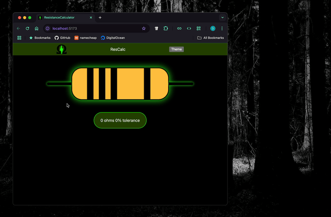

# ResistanceCalculator

## Application for calculating the Ohm rating of a resistor

### (React - Vite)

## toDo

     accessibility
          more contrasting resistor/band colors

     add labelDisplayButton
          text values on colorButtons

          text labels for band purposes

     style theme button

     choose new font

     3-5-6 band resistor pages
